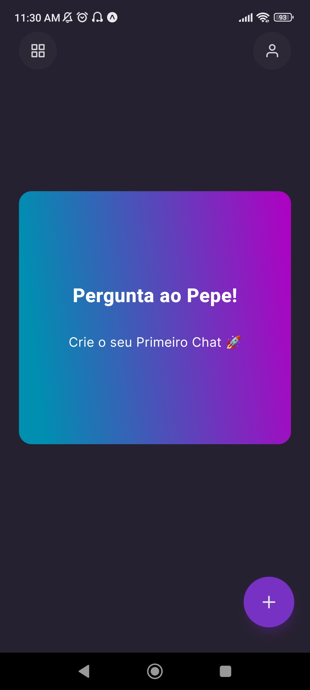
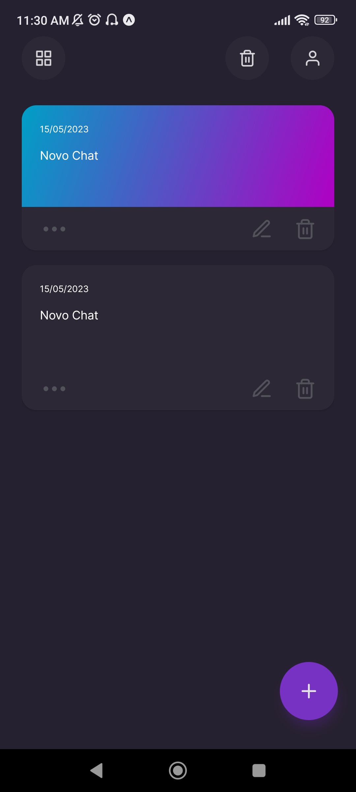

# Pergunte Ai 🤖

Um aplicativo de chat onde você pode fazer **perguntas** e obter **respostas** usando a API do [ChatGPT](https://platform.openai.com/docs/introduction).  O aplicativo utiliza o[Async Storage](https://docs.expo.dev/versions/unversioned/sdk/async-storage/) para armazenar os chats, [NativeWind](https://github.com/native-ly/native-wind) para estilização e o [Moti](https://moti.fyi/) para animações.

   

## 🚀 Tecnologias utilizadas

- [React Native](https://reactnative.dev/)
- [React Navigation](https://reactnavigation.org/)
- [Moti](https://moti.fyi/)
- [Async Storage](https://docs.expo.dev/versions/unversioned/sdk/async-storage/)
- [Day.js](https://day.js.org/)
- [NativeWind](https://github.com/native-ly/native-wind)
- [Awesome Alerts](https://www.npmjs.com/package/react-native-awesome-alerts)
- [Expo Updates](https://docs.expo.io/bare/updating-your-app/)
- [Expo Clipboard](https://docs.expo.io/versions/latest/sdk/clipboard/)


## Instalação

1. Clone o repositório.
2. Instale as dependências:

   ```bash
   npm install
   ```

3. Crie um arquivo \`.env\` na raiz do projeto com a apikey fornecida pelo [ChatGPT](https://platform.openai.com/account/api-keys):

   ```js
     CHAT_GPD_API_KEY = 'YOUR_API_KEY',
   ```

4. Inicie o aplicativo:

   ```bash
   npx expo start
   ```

## Licença

Este projeto está licenciado sob a Licença MIT.
<br></br>

Projeto desenvolvido com 🤍 por [M4rcotoni](https://github.com/m4rcotoni)
